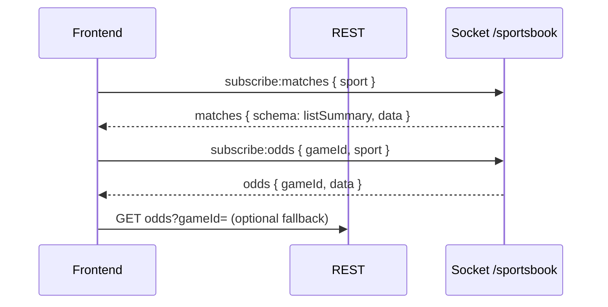

# Sportsbook frontend — single implementation guide

**Use only this file** for Cursor or the frontend team. It replaces all older sportsbook frontend walkthroughs.

**Rules**

1. **Never call Professorji** (or any third-party odds URL) from the browser. Use only your **backend** REST + Socket namespace **`/sportsbook`**.
2. **One** Socket.IO connection per tab; change **subscriptions** (`subscribe:matches` / `subscribe:odds`), not multiple connections.
3. **List** = socket event `matches` with `schema: 'listSummary'`. **Detail** = socket event `odds` after `subscribe:odds`.
4. REST is optional (hydrate / SEO / timeout fallback). Backend may serve from Professorji when Redis is empty or down (`SPORTSBOOK_PROFESSORJI_FALLBACK`, default on) — **no frontend change**.

**Other backend docs:** [`../src/Sportbook/SPORTBOOK_USER_DEMO_WALKTHROUGH.md`](../src/Sportbook/SPORTBOOK_USER_DEMO_WALKTHROUGH.md) · [`POLLING_PERF.md`](./POLLING_PERF.md) *(paths resolve in a full-stack or backend checkout; not shipped in this frontend-only repo.)*

**Also in this repo:** [Sportsbook_API_Reference.md](./Sportsbook_API_Reference.md) · [SPORTSBOOK_REALTIME.md](./SPORTSBOOK_REALTIME.md)

**This repository (`betting_web`, JavaScript):** `src/socket/sportsbookSocket.js` (one connection, array emits, unwraps `{ items: [...] }` / top-level arrays on `matches` / `odds` / `scoreboard`), `src/utils/sportsbookMatchesPayload.js` (`expandSocketBatchPayload` ≡ spec `unwrapSportsbookEvent`, `getMatchRowsFromSocketPayload`, `listSummaryRowToLegacyMatch`), `src/context/SportsbookStore.js`. Optional: `REACT_APP_SPORTSBOOK_LEGACY_SOCKET_EMIT` for legacy single-object emits.

---

## 1) Folder layout (suggested)

```text
src/sportsbook/
  api/sportsbookApi.ts
  socket/sportsbookSocket.ts
  types/sportsbook.types.ts
  hooks/useSportsbookSocket.ts | useMatchesList.ts | useMatchOdds.ts | useScoreboardStream.ts
  stores/oddsByGameId.ts
  components/MatchListRow.tsx | OddsLadder.tsx | MarketTabs.tsx
  pages/SportsInPlayPage.tsx | MatchDetailPage.tsx
```

---

## 2) REST

- **Base:** `/api/v1/sportsbook` (confirm with your gateway).
- **Sports:** `cricket` | `soccer` | `tennis` (UI “Football” → **`soccer`**).

| Method | Path |
|--------|------|
| GET | `/:sportName/matches` — full match objects (not the same shape as socket `listSummary`) |
| GET | `/:sportName/matches-with-odds` |
| GET | `/:sportName/odds?gameId=` (soccer/tennis: same id as list `gameId`) |
| GET | `/stream/hints` — subscribe event names |

---

## 3) Socket.IO

```ts
import { io, Socket } from 'socket.io-client';

let socket: Socket | null = null;

export function getSportsbookSocket(apiOrigin: string, opts?: { token?: string }) {
  if (socket?.connected) return socket;
  socket = io(`${apiOrigin}/sportsbook`, {
    path: '/socket.io',
    auth: opts?.token ? { token: opts.token } : {},
    transports: ['websocket', 'polling'],
  });
  return socket;
}
```

**Emit (array protocol — preferred)**

The **first Socket.IO data argument** is an **array** of subscription objects. Empty arrays are ignored. The server loops each entry; duplicate `sport` / `gameId` in one batch are deduped (idempotent joins).

| Event | Payload (first argument) | When |
|-------|---------------------------|------|
| `subscribe:matches` | `[{ sport: 'cricket' \| 'soccer' \| 'tennis' }, …]` | List / landing — **send only `sport`** (no `gameId` / `eventId`; server ignores extras) |
| `unsubscribe:matches` | `[{ sport }, …]` | Leave list (optional). Alias: `matches:unsubscribe` — **only `sport`** |
| `subscribe:odds` | `[{ gameId, sport? }, …]` | Open match(s) — **pass `sport` when known** |
| `unsubscribe:odds` | `[{ gameId }, …]` | Back to list / drop rooms |
| `subscribe:scoreboard` | `[{ gameId, sport? }, …]` | In-play score stream |
| `unsubscribe:scoreboard` | `[{ gameId }, …]` | Alias: `scoreboard:unsubscribe` |
| `ping` | `{}` | RTT |

**Legacy (still accepted):** a single object instead of an array, e.g. `subscribe:matches`, `{ sport: 'cricket' }`. For match-level ids use **`subscribe:odds`** after the user opens a row.

**Server behaviour:** `subscribe:matches` payloads are normalised to **`{ sport }` only** — any `gameId`, `eventId`, or other fields are dropped and do not affect rooms or the list snapshot.

Aliases: `matches:subscribe`, `odds:subscribe`, `odds:unsubscribe`, etc.

**`subscribe:matches` batch reply:** If you send `[{ sport: 'cricket' }, { sport: 'tennis' }, …]` in one emit, the **initial snapshot** is a **single** `matches` event: `{ items: [ { sport, schema, data, timestamp }, … ] }` — one object per sport (deduped order). Later **feed** updates may still arrive as separate `matches` events per sport room.

**Listen — server → client (`items` envelope)**

By default the server sends **either** a legacy **single message object** **or** `{ items: [ … ] }` where each element is self-contained:

- **`matches`:** `{ sport, schema: 'listSummary', data, timestamp?, error?, message? }`
- **`odds`:** `{ gameId, data, timestamp?, contentHash?, source?, eventId? }`
- **`scoreboard`:** `{ gameId, data, timestamp?, eventId? }`

Normalize in one place:

```ts
function unwrapSportsbookEvent<T extends Record<string, unknown>>(raw: unknown): T[] {
  if (raw == null) return [];
  if (Array.isArray(raw)) return raw as T[];
  if (typeof raw === 'object' && Array.isArray((raw as { items?: unknown }).items)) {
    return ((raw as { items: T[] }).items ?? []) as T[];
  }
  if (typeof raw === 'object') return [raw as T];
  return [];
}
```

Then `for (const msg of unwrapSportsbookEvent(payload)) { … }` per event.

| Event | Action |
|-------|--------|
| `matches` | For each unwrapped message: if `schema === 'listSummary'`, merge/replace list state from `data`. |
| `odds` | For each: update `oddsByGameId[msg.gameId] = msg.data`. Optional `contentHash`, `source`. |
| `scoreboard` | For each: update score for `msg.gameId` from `msg.data`. |
| `pong` | After `ping` |

**Ops:** If an old web build cannot parse `{ items: [...] }`, set backend `SPORTSBOOK_SOCKET_LEGACY_WIRE_FORMAT=1` to restore single-object emits until clients are updated.

**Reconnect:** re-emit all active subscriptions in **array** form (idempotent on the server).

---

## 4) List payload (`listSummary`)

```ts
export interface MatchesListMessage {
  sport: 'cricket' | 'soccer' | 'tennis';
  schema: 'listSummary';
  data: MatchSummaryRow[];
  timestamp: number;
  error?: boolean;
  message?: string;
  source?: 'professorji';
}

export interface MarketLabel {
  code: 'mo' | 'bm' | 'f';
  name: string;
}

export interface LadderRung {
  price: number | null;
  stack: number | null;
  open: boolean;
}

export interface SelectionSummary {
  selectionId?: string;
  name: string;
  back: [LadderRung, LadderRung, LadderRung];
  lay: [LadderRung, LadderRung, LadderRung];
  backOpen: boolean;
  layOpen: boolean;
}

export interface MatchSummaryRow {
  gameId: string;
  name: string;
  sport: string;
  inPlay: boolean;
  /** Provider kickoff string when present (e.g. `2026-03-29T18:30`) — show beside LIVE / under badge if you prefer raw text. */
  eventTime: string | null;
  /** ISO 8601 UTC when parseable — use for locale formatting, sorting, “starts in …”. */
  startTime: string | null;
  markets: MarketLabel[];
  selections: SelectionSummary[];
  marketClosed: boolean;
}
```

**List UI:** per row render title `name`, chips from `markets`, then each `selections[]` as **6 cells** (3 Back + 3 Lay) from `back[0..2]` / `lay[0..2]` — show `price`, format `stack` (e.g. K). Dim if `!rung.open`. **Kickoff:** if `inPlay`, still show `eventTime` or formatted `startTime` next to the LIVE badge when either is non-null; for pre-match rows prefer formatted `startTime` (or `eventTime` as fallback).

**Date/time is the same field for every sport.** Professorji uses `eventTime` on cricket rows but **`eventDate` / `startDate`** on soccer and tennis. The server normalizes all of that into **`eventTime`** (display string) and **`startTime`** (ISO UTC when parseable) on each `listSummary` row. If tennis/football rows show no time, the UI is usually only binding kickoff for cricket — use the same snippet for **Football (`soccer`)** and **Tennis** rows after you unwrap `matches` → `items[]` → `data[]`.

**Why soccer/tennis list odds often look slower than cricket**

1. **Bigger lists & the same odds cap** — The feed still attaches main-line ladders for at most **`SOCKET_MATCHES_SUMMARY_ODDS_LOOKUP`** events per sport (default 40). Cricket’s live page is smaller; soccer can have many more rows, so a visible match may be **outside** the first 40 until you scroll or the list order/cache catches up — cells show **“-”** until then.
2. **Heavier books** — Soccer/tennis payloads go through **`normalizeOddsResponse`** (large `fancyOdds` / side markets). Filling Redis and hashing takes more work per event than typical cricket list odds.
3. **Provider latency** — The backend uses **longer HTTP timeouts** for soccer/tennis matches/odds than for cricket; the third-party API is often slower for those sports.
4. **Detail path** — Opening a match and **`subscribe:odds`** always requests a full book for that `gameId`, so prices appear even when the list ladder was empty.

Tune ops (optional): raise **`SOCKET_MATCHES_SUMMARY_ODDS_LOOKUP`** (and feed **`SPORTSBOOK_FEED_ODDS_LIMIT`**) carefully — more Redis reads and provider load per tick.

**Adapter (this repo):** `getMatchRowsFromSocketPayload()` + `listSummaryRowToLegacyMatch()` in `src/utils/sportsbookMatchesPayload.js` map `listSummary` rows to a legacy-compatible shape (`eventTime` / `startTime` preserved for list UIs).

---

## 5) Detail payload (`odds`)

Same normalized book as REST `GET .../odds`:

```ts
export interface OddsMessage {
  gameId: string;
  data: OddsPayload;
  timestamp: number;
  contentHash?: string;
  source?: 'professorji';
}

export type SportName = 'cricket' | 'soccer' | 'tennis';

export interface OddsRunner {
  selectionId: string;
  selectionName: string;
  b1?: number | null;
  b2?: number | null;
  b3?: number | null;
  l1?: number | null;
  l2?: number | null;
  l3?: number | null;
  back1?: number | null;
  back2?: number | null;
  back3?: number | null;
  lay1?: number | null;
  lay2?: number | null;
  lay3?: number | null;
  bs1?: number | null;
  bs2?: number | null;
  bs3?: number | null;
  ls1?: number | null;
  ls2?: number | null;
  ls3?: number | null;
  status?: string;
}

export interface OddsMarket {
  marketId?: string;
  marketName?: string;
  runners?: OddsRunner[];
}

export interface OddsPayload {
  matchOdds: OddsMarket[];
  bookMakerOdds: OddsMarket[];
  fancyOdds: OddsMarket[];
  marketClosed: boolean;
  oddsUpdatedAt?: number;
  liveScore?: unknown;
  tvUrl?: string | null;
  eventId?: string;
  sport?: string;
}
```

**Detail UI:** six cells per runner (3 back, 3 lay). Missing `b2`/`b3` → locked, not `0`. Prefer `matchOdds` / `bookMakerOdds` / `fancyOdds` for rendering.

---

## 6) Screen flows

**List**

1. Connect socket → `subscribe:matches` `{ sport }`.
2. Render `matches` with `schema: 'listSummary'`.
3. On row click: navigate with `gameId` + `sport`.

**Detail**

1. Optionally `unsubscribe:matches`.
2. `subscribe:odds` `{ gameId, sport }`.
3. Store `odds` by `gameId`; render full markets.
4. On leave: `unsubscribe:odds`, re-`subscribe:matches` if returning to list.

**Optional:** REST `GET matches` / `GET odds` for first paint or after socket timeout.

---

## 7) Bets (`POST` place)

Send `sport`, `gameId`, `marketType`, `marketId`, `selectionId`, `selectionName`, `betType`, `odds`, `stake`. Optional **`priceVersion`** from `oddsUpdatedAt` for stale-slip handling. Backend accepts ladder prices matching b1–b3 / l1–l3.

---

## 8) Resilience

| Topic | Action |
|-------|--------|
| Reconnect | Re-subscribe all active channels |
| Strict mode | Dedupe subscriptions (`useRef` / store) |
| Empty odds | Loading 2–8s then REST `GET .../odds` |
| `schema !== 'listSummary'` | Log warning; do not assume legacy raw array in `data` |
| Volatile odds | If server uses `SOCKET_VOLATILE_ODDS`, tolerate gaps |

---

## 9) QA checklist

- [ ] List after `subscribe:matches` receives `listSummary` with ladders.
- [ ] Detail after `subscribe:odds` receives full book; updates over time.
- [ ] Back navigation cleans up `subscribe:odds`.
- [ ] Reconnect restores subs; no duplicate listeners on remount.
- [ ] No Professorji hostnames in browser Network tab.

---

## 10) Cursor prompt

```text
Implement the sportsbook UI per docs/FRONTEND_SPORTSBOOK.md:
- socket.io-client → /sportsbook, one connection
- list: subscribe:matches, render listSummary (3 back + 3 lay per selection)
- detail: subscribe:odds with gameId + sport, render full OddsPayload
- TypeScript types from that doc; never call third-party odds APIs from the browser
```

---

## 11) Backend reference (debug)

| Topic | Path |
|-------|------|
| List summary builder | `src/Sportbook/utils/matchSocketLite.js` |
| Socket attach / handlers | `src/Sportbook/socket/sportsbookSocket.js` |
| Broadcast / hash dedupe | `src/Sportbook/socket/sportsbookBroadcast.js` |
| Feed job | `src/jobs/sportsbookFeedRedis.job.js` |
| PJ fallback flag | `src/Sportbook/services/sportsbookProfessorjiFallback.service.js` |
| REST + fallback | `src/Sportbook/controllers/sportbook.controller.js` |

*(Paths refer to the backend repository, not this frontend app.)*

---

## 12) Sequence (reference)



---

## 13) You do not implement on the client

Redis, polling, or room naming — only subscribe payloads. Server owns feed + fallback.

---

## 14) For frontend devs — “wrong shape” on the InPlay list

### What you should build against

When you listen to the **`matches`** event, Socket.IO gives you **one JavaScript object** (the event payload). Treat it like this:

```ts
// What you expect from the server (InPlay / list screen)
interface MatchesEventPayload {
  sport: 'cricket' | 'soccer' | 'tennis';
  schema: 'listSummary';
  timestamp: number;
  data: Array<{
    gameId: string;           // use this for routing + subscribe:odds
    name: string;             // match title for the row
    sport: string;
    inPlay: boolean;          // LIVE badge
    eventTime: string | null; // provider kickoff text (show near LIVE if set)
    startTime: string | null; // ISO UTC when parseable — format in user locale
    marketClosed: boolean;
    markets: Array<{ code: 'mo' | 'bm' | 'f'; name: string }>;
    selections: Array<{
      name: string;
      back: [{ price, stack, open }, x3];
      lay: [{ price, stack, open }, x3];
      backOpen: boolean;
      layOpen: boolean;
    }>;
  }>;
}
```

Your list/grid components should read **`payload.data`** (the array of rows) and **`payload.schema === 'listSummary'`** before rendering the ladder UI.

---

### What looks “wrong” (and why the UI breaks)

Sometimes people inspect the **Network → WebSocket → Messages** tab and see a **raw string** starting with `42/sportsbook,["matches",…]`.

- That string is **Engine.IO framing**, not your app payload.
- **Do not** `JSON.parse` that whole string in the UI. The **socket.io-client** library already unpacks it.

Correct pattern:

```ts
socket.on('matches', (payload) => {
  if (payload?.schema !== 'listSummary') {
    console.warn('Unexpected matches shape', payload);
    return;
  }
  setRows(payload.data);
});
```

Another “wrong” shape is when **`payload.data[0]`** still looks like a **provider match row**:

- Fields like **`eventId`**, **`eventName`**, **`eventDate`**, **`seriesName`**, **`marketId: null`**
- **No** `selections` array, **no** `schema` on the message

That is **not** the contract your UI should implement. It usually means:

1. **Backend** is an old build or wasn’t restarted after an update — ask backend to run the app from the main **`wrathcode_betting_backend`** folder (the one that uses `./src`), restart the process, and pull latest.
2. After backend is fixed, you should see **`schema: 'listSummary'`** and rows with **`gameId` + `name` + `selections`**.

---

### Empty ladders (`selections: []`) on soccer/tennis

The list endpoint only includes **main-line** prices when the server has **odds in cache** for that match. If odds aren’t filled yet, you can still show the row (name, `gameId`, LIVE) but **Back/Lay cells stay empty or locked** until:

- the feed refreshes, or  
- the user opens the match and you **`subscribe:odds`** for full depth.

That is expected; it is not a frontend parsing bug.

---

### Quick checklist (frontend)

| Check | Pass? |
|-------|-------|
| Using `socket.io-client` (not raw WebSocket) | ☐ |
| Handler is `socket.on('matches', (payload) => …)` | ☐ |
| Reading `payload.data`, not the `42/...` frame string | ☐ |
| Checking `payload.schema === 'listSummary'` | ☐ |
| Row key / detail route uses `row.gameId` | ☐ |

---

*Consolidated: listSummary socket + Professorji server-side fallback + single-connection model + array/`items` wire format.*
