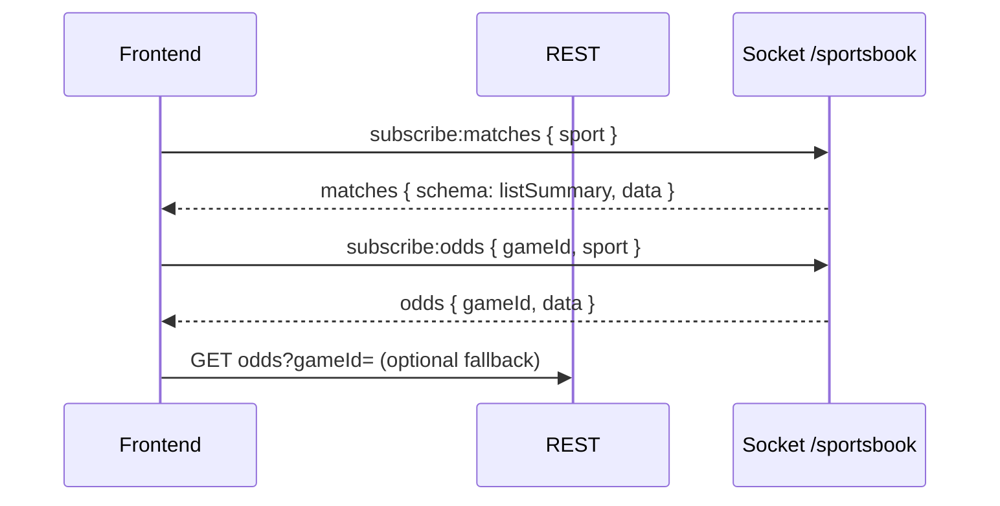

# Sportsbook frontend — single implementation guide

**Use only this file** for Cursor or the frontend team. It replaces all older sportsbook frontend walkthroughs.

**Rules**

1. **Never call Professorji** (or any third-party odds URL) from the browser. Use only your **backend** REST + Socket namespace **`/sportsbook`**.
2. **One** Socket.IO connection per tab; change **subscriptions** (`subscribe:matches` / `subscribe:odds`), not multiple connections.
3. **List** = socket event `matches` with `schema: 'listSummary'`. **Detail** = socket event `odds` after `subscribe:odds`.
4. REST is optional (hydrate / SEO / timeout fallback). Backend may serve from Professorji when Redis is empty or down (`SPORTSBOOK_PROFESSORJI_FALLBACK`, default on) — **no frontend change**.

**Other docs in this repo:** [Sportsbook_API_Reference.md](./Sportsbook_API_Reference.md) · [SPORTSBOOK_REALTIME.md](./SPORTSBOOK_REALTIME.md)

**Backend-only references** (paths live in the API/backend repository): `SPORTBOOK_USER_DEMO_WALKTHROUGH.md`, `POLLING_PERF.md`, `src/Sportbook/...`

---

## 1) Folder layout (suggested)

```text
src/sportsbook/
  api/sportsbookApi.ts
  socket/sportsbookSocket.ts
  types/sportsbook.types.ts
  hooks/useSportsbookSocket.ts | useMatchesList.ts | useMatchOdds.ts | useScoreboardStream.ts
  stores/oddsByGameId.ts
  components/MatchListRow.tsx | OddsLadder.tsx | MarketTabs.tsx
  pages/SportsInPlayPage.tsx | MatchDetailPage.tsx
```

**This app (JS):** see `src/socket/sportsbookSocket.js`, `src/utils/sportsbookMatchesPayload.js`, `src/context/SportsbookStore.js`.

---

## 2) REST

- **Base:** `/api/v1/sportsbook` (confirm with your gateway).
- **Sports:** `cricket` | `soccer` | `tennis` (UI “Football” → **`soccer`**).

| Method | Path |
|--------|------|
| GET | `/:sportName/matches` — full match objects (not the same shape as socket `listSummary`) |
| GET | `/:sportName/matches-with-odds` |
| GET | `/:sportName/odds?gameId=` (soccer/tennis: same id as list `gameId`) |
| GET | `/stream/hints` — subscribe event names |

---

## 3) Socket.IO

```ts
import { io, Socket } from 'socket.io-client';

let socket: Socket | null = null;

export function getSportsbookSocket(apiOrigin: string, opts?: { token?: string }) {
  if (socket?.connected) return socket;
  socket = io(`${apiOrigin}/sportsbook`, {
    path: '/socket.io',
    auth: opts?.token ? { token: opts.token } : {},
    transports: ['websocket', 'polling'],
  });
  return socket;
}
```

**Emit**

| Event | Payload | When |
|-------|---------|------|
| `subscribe:matches` | `{ sport }` (one emit per sport; home uses `subscribeMatchesMany` → 3 emits) | List / landing mounts |
| `unsubscribe:matches` | `{ sport }` | Leave list (optional) |
| `subscribe:odds` | `{ gameId, sport? }` per emit (default client) | Set `REACT_APP_SPORTSBOOK_ODDS_BATCH=true` for one emit `{ items: [...] }` if backend supports it. |
| `unsubscribe:odds` | `{ gameId }` per emit (default) | With batch env: `{ gameIds: [...] }`. |
| `subscribe:scoreboard` | `{ gameId }` | Detail, in-play (optional) |
| `ping` | `{}` | RTT |

Aliases: `matches:subscribe`, `odds:subscribe`, etc.

**Listen**

| Event | Action |
|-------|--------|
| `matches` | If `schema === 'listSummary'`, set state from `data` (array of `MatchSummaryRow`). Handle `error`, `message`. |
| `odds` | Update `gameId` → full odds payload. Optional `contentHash`, `source: 'professorji'`. |
| `scoreboard` | Live score strip |
| `pong` | After `ping` |

**Reconnect:** re-emit all active `subscribe:matches`, `subscribe:odds`, `subscribe:scoreboard`.

---

## 4) List payload (`listSummary`)

```ts
export interface MatchesListMessage {
  sport: 'cricket' | 'soccer' | 'tennis';
  schema: 'listSummary';
  data: MatchSummaryRow[];
  timestamp: number;
  error?: boolean;
  message?: string;
  source?: 'professorji';
}

export interface MarketLabel {
  code: 'mo' | 'bm' | 'f';
  name: string;
}

export interface LadderRung {
  price: number | null;
  stack: number | null;
  open: boolean;
}

export interface SelectionSummary {
  selectionId?: string;
  name: string;
  back: [LadderRung, LadderRung, LadderRung];
  lay: [LadderRung, LadderRung, LadderRung];
  backOpen: boolean;
  layOpen: boolean;
}

export interface MatchSummaryRow {
  gameId: string;
  name: string;
  sport: string;
  inPlay: boolean;
  markets: MarketLabel[];
  selections: SelectionSummary[];
  marketClosed: boolean;
}
```

**List UI:** per row render title `name`, chips from `markets`, then each `selections[]` as **6 cells** (3 Back + 3 Lay) from `back[0..2]` / `lay[0..2]` — show `price`, format `stack` (e.g. K). Dim if `!rung.open`.

**Adapter (this repo):** `getMatchRowsFromSocketPayload()` in `src/utils/sportsbookMatchesPayload.js` maps `listSummary` rows to a legacy-compatible shape so existing list screens keep working until the ladder UI ships.

---

## 5) Detail payload (`odds`)

Same normalized book as REST `GET .../odds`:

```ts
export interface OddsMessage {
  gameId: string;
  data: OddsPayload;
  timestamp: number;
  contentHash?: string;
  source?: 'professorji';
}

export type SportName = 'cricket' | 'soccer' | 'tennis';

export interface OddsRunner {
  selectionId: string;
  selectionName: string;
  b1?: number | null;
  b2?: number | null;
  b3?: number | null;
  l1?: number | null;
  l2?: number | null;
  l3?: number | null;
  back1?: number | null;
  back2?: number | null;
  back3?: number | null;
  lay1?: number | null;
  lay2?: number | null;
  lay3?: number | null;
  bs1?: number | null;
  bs2?: number | null;
  bs3?: number | null;
  ls1?: number | null;
  ls2?: number | null;
  ls3?: number | null;
  status?: string;
}

export interface OddsMarket {
  marketId?: string;
  marketName?: string;
  runners?: OddsRunner[];
}

export interface OddsPayload {
  matchOdds: OddsMarket[];
  bookMakerOdds: OddsMarket[];
  fancyOdds: OddsMarket[];
  marketClosed: boolean;
  oddsUpdatedAt?: number;
  liveScore?: unknown;
  tvUrl?: string | null;
  eventId?: string;
  sport?: string;
}
```

**Detail UI:** six cells per runner (3 back, 3 lay). Missing `b2`/`b3` → locked, not `0`. Prefer `matchOdds` / `bookMakerOdds` / `fancyOdds` for rendering.

---

## 6) Screen flows

**List**

1. Connect socket → `subscribe:matches` `{ sport }`.
2. Render `matches` with `schema: 'listSummary'`.
3. On row click: navigate with `gameId` + `sport`.

**Detail**

1. Optionally `unsubscribe:matches`.
2. `subscribe:odds` `{ gameId, sport }`.
3. Store `odds` by `gameId`; render full markets.
4. On leave: `unsubscribe:odds`, re-`subscribe:matches` if returning to list.

**Optional:** REST `GET matches` / `GET odds` for first paint or after socket timeout.

---

## 7) Bets (`POST` place)

Send `sport`, `gameId`, `marketType`, `marketId`, `selectionId`, `selectionName`, `betType`, `odds`, `stake`. Optional **`priceVersion`** from `oddsUpdatedAt` for stale-slip handling. Backend accepts ladder prices matching b1–b3 / l1–l3.

---

## 8) Resilience

| Topic | Action |
|-------|--------|
| Reconnect | Re-subscribe all active channels |
| Strict mode | Dedupe subscriptions (`useRef` / store) |
| Empty odds | Loading 2–8s then REST `GET .../odds` |
| `schema !== 'listSummary'` | Log warning; do not assume legacy raw array in `data` |
| Volatile odds | If server uses `SOCKET_VOLATILE_ODDS`, tolerate gaps |

---

## 9) QA checklist

- [ ] List after `subscribe:matches` receives `listSummary` with ladders.
- [ ] Detail after `subscribe:odds` receives full book; updates over time.
- [ ] Back navigation cleans up `subscribe:odds`.
- [ ] Reconnect restores subs; no duplicate listeners on remount.
- [ ] No Professorji hostnames in browser Network tab.

---

## 10) Cursor prompt

```text
Implement the sportsbook UI per docs/FRONTEND_SPORTSBOOK.md:
- socket.io-client → /sportsbook, one connection
- list: subscribe:matches, render listSummary (3 back + 3 lay per selection)
- detail: subscribe:odds with gameId + sport, render full OddsPayload
- TypeScript types from that doc; never call third-party odds APIs from the browser
```

---

## 11) Backend reference (debug)

| Topic | Path |
|-------|------|
| List summary builder | `src/Sportbook/utils/matchSocketLite.js` |
| Socket attach / handlers | `src/Sportbook/socket/sportsbookSocket.js` |
| Broadcast / hash dedupe | `src/Sportbook/socket/sportsbookBroadcast.js` |
| Feed job | `src/jobs/sportsbookFeedRedis.job.js` |
| PJ fallback flag | `src/Sportbook/services/sportsbookProfessorjiFallback.service.js` |
| REST + fallback | `src/Sportbook/controllers/sportbook.controller.js` |

*(Paths refer to the backend repository, not this frontend app.)*

---

## 12) Sequence (reference)



---

## 13) You do not implement on the client

Redis, polling, or room naming — only subscribe payloads. Server owns feed + fallback.

---

*Consolidated: listSummary socket + Professorji server-side fallback + single-connection model.*
